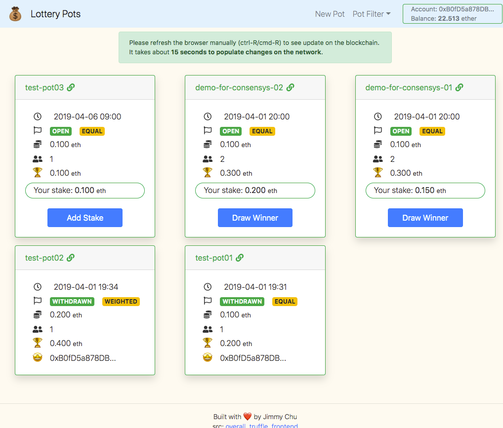

# Readme



### What does it do?

Lottery dApp: [https://lottery.dapp.hkwtf.com/](https://lottery.dapp.hkwtf.com/)

A [Youtube video demo](https://youtu.be/YLab2Zu-Yeg) can be seen here.

It is a lottery app where users can come and create lottery pot to play with their friends. They will specify the pot closed time, minimum stake to participate, the pot type (equal opportunity or weighted opportunity), and the stake they will take.

Then the lottery pot is open and allow anyone to participate. Once the closed time is reached, further interaction will mark the contract as closed, and winner can be determined randomly.

Finally the winner can withdraw money from the lottery pot.

### How to setup a local server?

The consensys project repo are at:

- [main repo](https://github.com/dev-bootcamp-2019/final-project-jimmychu0807), with two git submodules of,
- [the smart contracts using truffle framework](https://github.com/jimmychu0807/final-project-truffle),
- and [the React frontend](https://github.com/jimmychu0807/final-project-www). It is created with the [create-react-app](https://github.com/facebook/create-react-app) boilerplate.

To setup the local server,

- Install [Ganache](https://truffleframework.com/ganache) and run it locally on port `7545`.

- git clone the smart contracts repo and run

    ```sh
    # to compile the project
    yarn compile

    # to migrate the smart contract to blockchain
    truffle migrate

    # to run all the truffle test
    yarn test
    ```

  This will build the contract artifacts under `build/contracts` folder.

- Then, git clone the frontend repo, and symbolic link the contract artifact folder at `src/contracts`.

  Now you can

    ```sh
    # to run the dev version
    yarn start:dev

    # to build the production version
    yarn build
    ```

### Other documentations

- [Contracts Deployed Address](./deployed_address.txt)
- [Design Pattern Decisions](./design_pattern_decisions.md)
- [Security Concern](./avoiding_common_attacks.md)
